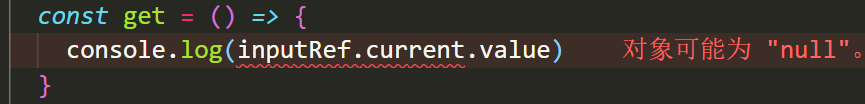
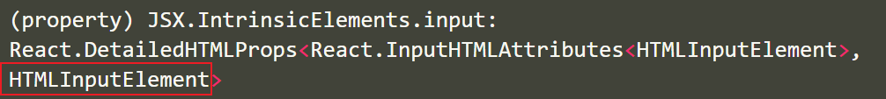
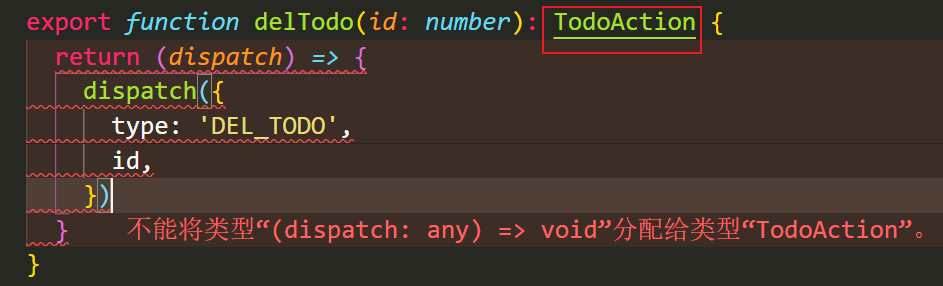
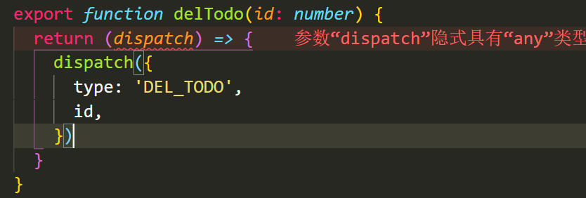

# React与Typescript

## useState的使用

**目标：**掌握useState hooks配合typescript使用

**内容：**

+ `useState`接收一个泛型参数，用于指定初始值的类型
+ `useState`的源码如下

```jsx
/**
 * Returns a stateful value, and a function to update it.
 *
 * @version 16.8.0
 * @see https://reactjs.org/docs/hooks-reference.html#usestate
 */
function useState<S>(initialState: S | (() => S)): [S, Dispatch<SetStateAction<S>>];
```

+ `useState`的使用

```jsx
const [name, setName] = useState<string>('张三')
const [age, setAge] = useState<number>(28)
const [isProgrammer, setIsProgrammer] = useState<boolean>(true)

// 如果你在set函数中的参数不符合声明的变量类型，程序会报错
<button onClick={() => setName(100)}>按钮</button>  // 报错
```

+ `useState`的类型推断，在使用useState的时候，只要提供了初始值，typescript会自动根据初始值进行类型推断，因此`useState`的泛型参数可以省略

```jsx
export default function App() {
  const [name, setName] = useState('张三')
  const [age, setAge] = useState(28)
  const [isProgrammer, setIsProgrammer] = useState(true)
  return (
    <div>
      <button onClick={() => setName(100)}>按钮</button>
    </div>
  )
}

```

## useEffect的使用

**目标：**掌握useEffect hook在typescript中的使用

**内容**

+ `useEffect`是用于我们管理副作用（例如 API 调用）并在组件中使用 React 生命周期的
+ `useEffect`的源码

```jsx
/**
 * Accepts a function that contains imperative, possibly effectful code.
 *
 * @param effect Imperative function that can return a cleanup function
 * @param deps If present, effect will only activate if the values in the list change.
 *
 * @version 16.8.0
 * @see https://reactjs.org/docs/hooks-reference.html#useeffect
 */
function useEffect(effect: EffectCallback, deps?: DependencyList): void;
```

+ `useEffect`函数不涉及到任何泛型参数，在typescript中使用和javascript中使用完全一致。

```jsx
useEffect(() => {
  // 给 window 绑定点击事件
  const handleClick = () => {
    console.log('哈哈哈')
  }
  window.addEventListener('click', handleClick)

  return () => {
    // 给 window 移除点击事件
    window.addEventListener('click', handleClick)
  }
}, [])
```

## useState 进阶用法

**目标：**能够使用useEffect发送请求并且配合useState进行渲染

**内容：**

+ 频道列表接口：`http://geek.itheima.net/v1_0/channels`

+ 需求，发送请求获取频道列表数据，并且渲染
+ **注意：**useState如果没有提供具体类型的初始值，是需要使用泛型参数指定类型的。

```jsx
// 存放频道列表数据
// 如果给useState的泛型参数直接指定为一个[]，那将会得到一个never类型的数据，渲染的时候会出问题
const [list, setList] = useState([])
```


+ 如果useState的初始值是一个复杂的数据类型，需要给useState指定泛型参数 

```jsx
import { useEffect, useState } from 'react'
import axios from 'axios'
type Res = {
  id: number
  name: string
}[]
export default function App() {
  // 存放频道列表数据
  const [list, setList] = useState<Res>([])
  useEffect(() => {
    const fetchData = async () => {
      const res = await axios.get('http://geek.itheima.net/v1_0/channels')
      setList(res.data.data.channels)
    }
    fetchData()
  }, [])
  return (
    <div>
      <ul>
        {list.map((item) => {
          return <li key={item.id}>{item.name}</li>
        })}
      </ul>
    </div>
  )
}

```

## useRef的使用

**目标：**能够使用useRef配合ts操作DOM

**内容：**

+ `useRef` 接收一个泛型参数，源码如下

```jsx
/**
 * `useRef` returns a mutable ref object whose `.current` property is initialized to the passed argument
 * (`initialValue`). The returned object will persist for the full lifetime of the component.
 *
 * Note that `useRef()` is useful for more than the `ref` attribute. It’s handy for keeping any mutable
 * value around similar to how you’d use instance fields in classes.
 *
 * @version 16.8.0
 * @see https://reactjs.org/docs/hooks-reference.html#useref
 */
function useRef<T>(initialValue: T): MutableRefObject<T>;
    
interface MutableRefObject<T> {
    current: T;
}
```

+ `useRef`的泛型参数用于指定current属性的值的类型

+ 如果使用useRef操作DOM，需要明确指定所操作的DOM的具体的类型，否则current属性会是null



+ 正确语法：

```jsx
const inputRef = useRef<HTMLInputElement>(null)
const get = () => {
  console.log(inputRef.current?.value)
}
```

+ **技巧：**如何获取一个DOM对象的类型，鼠标直接移动到该元素上，就会显示出来该元素的类型



## 可选链操作符

**目标：**掌握js中的提供的可选链操作符语法

**内容**

+ **可选链**操作符( **`?.`** )允许读取位于连接对象链深处的属性的值，而不必明确验证链中的每个引用是否有效。
+ 参考文档：https://developer.mozilla.org/zh-CN/docs/Web/JavaScript/Reference/Operators/Optional_chaining

```jsx
let nestedProp = obj.first?.second;
console.log(res.data?.data)
obj.fn?.()

if (obj.fn) {
    obj.fn()
}
obj.fn && obj.fn()

// 等价于
let temp = obj.first;
let nestedProp = ((temp === null || temp === undefined) ? undefined : temp.second);
```

## 非空断言

**目标：**掌握ts中的非空断言的使用语法

**内容：**

+ 如果我们明确的知道对象的属性一定不会为空，那么可以使用非空断言 `!`

```ts
// 告诉typescript, 明确的指定obj不可能为空
let nestedProp = obj!.second;
```

+ 注意：非空断言一定要确保有该属性才能使用，不然使用非空断言会导致bug

## react路由的使用

**目标：**能够在typescript中使用react路由

**内容：**

+ 安装react-router-dom的类型声明文件`yarn add @types/react-router-dom`
+ 新建组件`Home.tsx`和`Login.tsx`
+ 配置路由

```jsx
import { BrowserRouter as Router, Link, Route } from 'react-router-dom'
import Home from './pages/Home'
import Login from './pages/Login'
export default function App() {
  return (
    <Router>
      <div>
        <ul>
          <li>
            <Link to="/home">首页</Link>
          </li>
          <li>
            <Link to="/login">登录页</Link>
          </li>
        </ul>
        <div>
          <Route path="/home" component={Home}></Route>
          <Route path="/login" component={Login}></Route>
        </div>
      </div>
    </Router>
  )
}

```

+ **注意：**有了ts的支持后，代码提示变得非常的精确

## useHistory的使用

**目标：**掌握useHistory在typescript中的使用

**内容：**

+ useHistory可以实现路由之间的跳转，并且在跳转时可以指定跳转参数state的类型

+ useHistory的源码如下

```jsx
export function useHistory<HistoryLocationState = H.LocationState>(): H.History<HistoryLocationState>;
```

+ useHistory如果仅仅实现跳转功能，和js中使用语法一致

```jsx
const history = useHistory()
const login = () => {
  history.push('/login')
}
```

+ useHistory可以通过泛型参数来指定state的类型

```tsx
const history = useHistory<{
  aa: string
}>()
const login = () => {
  history.push({
    pathname: '/login',
    state: {
      aa: 'cc',
    },
  })
}
```

## useLocation的使用

**目标：**掌握useLocation在typescript中的使用

**内容：**

+ useLocation接收一个泛型参数，用于指定接收的state类型，与useHistory的泛型参数对应
+ useLocation的源码

```jsx
export function useLocation<S = H.LocationState>(): H.Location<S>;
```

+ 基本使用

```jsx
import { useLocation } from 'react-router'

export default function Home() {
  const location = useLocation<{ aa: string } | null>()
  const aa = location.state?.aa

  return <div>Home组件---{aa}</div>
}

```

**注意：**因为useLocation和useHistory都需要指定Location类型，因此可以将类型存放到通用的类型声明文件中

```tsx
// types.d.ts
export type LoginState = {
  aa: string
} | null
```

## useParams的使用

**目标**：能够掌握useParams在typescript中的使用

**内容：**

+ useParams接收一个泛型参数，用于指定params对象的类型
+ 基本使用

```jsx
import { useParams } from 'react-router'

export default function Article() {
  const params = useParams<{ id: string }>()
  console.log(params.id)

  return (
    <div>
      文章详情
      <div>12</div>
    </div>
  )
}
```

## unkonw类型

**目标：**了解什么是TS中的unknown类型

**内容：**

+ unknown是更加安全的any类型。
+ 我们可以对 any 进行任何操作，不需要检查类型。

```jsx
// 没有类型检查就没有意义了，跟写JS一样。很不安全。
let value:any
value = true
value = 1
value.length
```

+ 也可以把任何值赋值给 unknown,但是不能调用属性和方法，除非使用类型断言或者类型收窄

```tsx
let value:unknown
value = 'abc'

(value as string).length

if (typeof value === 'string') {
  value.length
}
```

## redux基本使用

**目标：**掌握在ts项目中如何初始化redux

**内容：**

+ 安装依赖包

```jsx
yarn add redux react-redux redux-devtools-extension
```

+ 新建文件 store/index.ts

```jsx
import { createStore } from 'redux'
import reducer from './reducers'
import { composeWithDevTools } from 'redux-devtools-extension'
const store = createStore(reducer, composeWithDevTools())

export default store

```

+ 新建文件 store/reducers/index.ts

```ts
import { combineReducers } from 'redux'
import todos from './todos'
const rootReducer = combineReducers({
  todos,
})
export default rootReducer

```

+ 新建文件 store/reducers/todos.ts

```ts
const initValue = [
  {
    id: 1,
    name: '吃饭',
    done: false,
  },
  {
    id: 2,
    name: '睡觉',
    done: true,
  },
  {
    id: 3,
    name: '打豆豆',
    done: false,
  },
]
export default function todos(state = initValue, action: any) {
  return state
}

```

+ index.tsx中

```tsx
import ReactDOM from 'react-dom'
import './index.css'
import App from './App'
import store from './store'
import { Provider } from 'react-redux'
ReactDOM.render(
  <Provider store={store}>
    <App />
  </Provider>,
  document.getElementById('root')
)

```

## useSelector的使用

**目标：**掌握useSelector在ts中的使用

**内容**

+ useSelector接收两个泛型参数
  + 类型变量TState用于指定state的类型
  + TSelected用于指定返回值的类型

```tsx
export function useSelector<TState = DefaultRootState, TSelected = unknown>(
    selector: (state: TState) => TSelected,
    equalityFn?: (left: TSelected, right: TSelected) => boolean
): TSelected;
```

+ useSelector的基本使用

```jsx
// 获取todos数据
const todos = useSelector<{ name: string }, string>((state) => state.name)
```

+ useSelector使用方式2，不指定泛型参数，直接指定state的类型
+ 参考文档：https://react-redux.js.org/using-react-redux/usage-with-typescript#typing-the-useselector-hook

```jsx
const todos = useSelector((state: { name: string }) => state.name)
```

**问题：如何准确的获取到store的类型？？**

## RootState获取

**目标：**能够掌握如何获取redux的rootState

**内容：**

+ 参考文档：https://react-redux.js.org/using-react-redux/usage-with-typescript

+ `typeof`可以获取某个数据的类型

```ts
function fn(n1: number, n2:number):number {
  return n1 + n2
}

// 获取fn函数的类型
type Fn = typeof fn
```

+ `ReturnType`是一个泛型工具类型，可以获取一个函数类型的返回值类型

```tsx
function fn(n1: number, n2:number):number {
  return n1 + n2
}

// 获取fn函数的类型
type Fn = typeof fn

// 获取Fn函数的返回值类型
type Res = ReturnType<Fn>
```

+ 获取RootState的操作 `store/index.tx`

```tsx
export type RootState = ReturnType<typeof store.getState>
```

+ **重要：**useSelector的正确用法

```tsx
import { RootState } from '../store'

// 获取todos数据
const todos = useSelector((state: RootState) => state.todos)
```

## reducer的使用

**目标：**掌握reducers在TS中的写法

**内容**：

+ 准备Action

```tsx
export function addTodo(name: string) {
  return {
    type: 'ADD_TODO',
    name,
  }
}

export function delTodo(id: number) {
  return {
    type: 'DEL_TODO',
    id,
  }
}

```

+ 需要给action提供类型

```jsx
export type TodoAction =
  | {
      type: 'ADD_TODO'
      name: string
    }
  | {
      type: 'DEL_TODO'
      id: number
    }

export const addTodo = (name: string): TodoAction => {
  return {
    type: 'ADD_TODO',
    name
  }
}

export const delTodo = (id: number): TodoAction => {
  return {
    type: 'DEL_TODO',
    id
  }
}

```

+ 在reducer中指定初始值的类型

```tsx
type TodosList = {
  id: number
  name: string
  done: boolean
}[]
const initValue: TodosList = []
export default function todos(state = initValue, action: any): TodosList {
  return state
}


```

+ 指定Action的类型

```jsx
import { TodoAction } from '../actions/todos'
```

+ 编写reducer

```jsx
import { TodoAction } from '../types'
export default function todos(
  state = initValue,
  action: TodoAction
): TodosList {
  if (action.type === 'ADD_TODO') {
    return [
      {
        id: Date.now(),
        name: action.name,
        done: false,
      },
      ...state,
    ]
  }
  if (action.type === 'DEL_TODO') {
    return state.filter((item) => item.id !== action.id)
  }
  return state
}
```


## useDispatch的使用

**目标：**掌握useDispatch在ts中的使用

**内容：**

+ useDispatch接收一个泛型参数用于指定Action的类型
+ 参考链接：https://react-redux.js.org/using-react-redux/usage-with-typescript#typing-the-usedispatch-hook

```jsx
const dispatch = useDispatch()

<button onClick={() => dispatch(delTodo(item.id))}>x</button>
```


## 事件对象的类型

**目标：**掌握事件对象在TS中如何指定类型

**内容：**

+ 在使用事件对象时，需要指定事件对象的类型

```tsx
const add = (e: React.KeyboardEvent<HTMLInputElement>) => {
  if (e.code === 'Enter') {
    dispatch(addTodo(name))
    setName('')
  }
}
```

+ 技巧：在行内事件中，鼠标移动到e上面可以看到具体的事件对象类型


## redux thunk的使用

**目标：**掌握redux thunk在typescript中的使用

**内容：**

+ 引入redux-thunk

```tsx
yarn add redux-thunk

import thunk from 'redux-thunk'
const store = createStore(reducer, composeWithDevTools(applyMiddleware(thunk)))
```

+ thunk类型的变更，使用了thunk之后，返回的Action类型不再是对象，而是函数类型的Action，因此需要修改Action的类型。





+ ThunkAction类型的使用
  + 参考文档：https://redux.js.org/usage/usage-with-typescript#type-checking-redux-thunks

```tsx
export type RootThunkAction = ThunkAction<void, RootState, unknown, TodoAction>

// 修改删除Action
export function delTodo(id: number): RootThunkAction {
  return (dispatch) => {
    setTimeout(() => {
      dispatch({
        type: 'DEL_TODO',
        id,
      })
    }, 1000)
  }
}
```

## redux-thunk版本bug

+ 在redux-thunk@2.4.0新版中，使用dispatch的时候，会丢失提示，需要降级到2.3.0版本

+ https://github.com/reduxjs/redux-thunk/issues/326

+ `yarn add redux-thunk@2.3.0`

## 综合案例-黑马头条

### 项目搭建

引入通用样式(资料中已经准备好)

```jsx
import './styles/index.css'
```

封装频道组件和新闻列表组件

`components/Channel.js`

```jsx
import React from 'react'

export default function Channel() {
  return (
    <ul className="catagtory">
      <li className="select">开发者资讯</li>
      <li>ios</li>
      <li>c++</li>
      <li>android</li>
      <li>css</li>
      <li>数据库</li>
      <li>区块链</li>
      <li>go</li>
      <li>产品</li>
      <li>后端</li>
      <li>linux</li>
      <li>人工智能</li>
      <li>php</li>
      <li>javascript</li>
      <li>架构</li>
      <li>前端</li>
      <li>python</li>
      <li>java</li>
      <li>算法</li>
      <li>面试</li>
      <li>科技动态</li>
      <li>js</li>
      <li>设计</li>
      <li>数码产品</li>
      <li>html</li>
      <li>软件测试</li>
      <li>测试开发</li>
    </ul>
  )
}

```

`components/NewsList.js`

```jsx
import React from 'react'
import avatar from '../assets/back.jpg'
export default function NewsList() {
  return (
    <div className="list">
      <div className="article_item">
        <h3 className="van-ellipsis">python数据预处理 ：数据标准化</h3>
        <div className="img_box">
          
        </div>
        <div className="info_box">
          <span>13552285417</span>
          <span>0评论</span>
          <span>2018-11-29T17:02:09</span>
        </div>
      </div>
    </div>
  )
}

```

根组件中渲染

```jsx
import React from 'react'
import Channel from './components/Channel'
import NewsList from './components/NewsList'
export default function App() {
  return (
    <div className="app">
      <Channel></Channel>
      <NewsList></NewsList>
    </div>
  )
}

```

准备静态资源

### 接口说明

获取频道列表 

http://geek.itheima.net/v1_0/channels

获取频道新闻

http://geek.itheima.net/v1_0/articles?channel_id=频道id&timestamp=时间戳

### 加载频道数据

步骤：

在store/reducers/channel.ts

```tsx
const initValue = {
  channelList: [],
  active: 0
}

export default function channel(state = initValue, action: any) {
  return state
}

```

在store/actions/channel.ts

```tsx
import axios from 'axios'
import { RootThunkAction } from '..'

export function getChannelList(): RootThunkAction {
  return async (dispatch) => {
    const res = await axios.get('http://geek.itheima.net/v1_0/channels')
    console.log(res)
  }
}

```

在components/Channel.tsx中

```tsx
export default function Channel() {
  const dispatch = useDispatch()
  useEffect(() => {
    dispatch(getChannelList())
  }, [dispatch])
```

### 把频道数据存储到redux

在store/actions/channel.ts

```tsx
import axios from 'axios'
import { RootThunkAction } from '..'

// 1. 提供了Channel的类型
export type Channel = {
  id: number
  name: string
}

// 2. 提供了ChannelAction的类型
export type ChannelAction = {
  type: 'channel/getChannelList'
  payload: Channel[]
}
export function getChannelList(): RootThunkAction {
  return async (dispatch) => {
    const res = await axios.get('http://geek.itheima.net/v1_0/channels')
    
    // 3. dispatch ChannelAction  问题： dispatch的时候没有提示
    dispatch({
      type: 'channel/getChannelList',
      payload: res.data.data.channels
    })
  }
}
```

在store/index.ts

```tsx
import { TodoAction } from './actions/todos'
import { ChannelAction } from './actions/channel'

export type RootAction = TodoAction | ChannelAction
export type RootThunkAction = ThunkAction<void, RootState, any, RootAction>
```

在store/reducers/index.ts

```tsx
import { Channel, ChannelAction } from '../actions/channel'

// 提供了channel默认的数据的类型
type ChannelType = {
  channelList: Channel[]
  active: number
}

// 指定初始值的类型
const initValue: ChannelType = {
  channelList: [],
  active: 0
}

// 指定了action的类型和返回值的类型
export default function channel(
  state = initValue,
  action: ChannelAction
): ChannelType {
  if (action.type === 'channel/getChannelList') {
    return {
      ...state,
      channelList: action.payload
    }
  }
  return state
}

```

### 频道列表数据的渲染

+ 在components/Channel.ts中通过useSelector获取频道的数据

```tsx
import { RootState } from '../store'

const channel = useSelector((state: RootState) => state.channel)
```

+ 渲染频道列表

```tsx
<ul className="catagtory">
  {channel.channelList.map((item) => {
    return (
      <li
        key={item.id}
        className={channel.active === item.id ? 'select' : ''}
      >
        {item.name}
      </li>
    )
  })}
</ul>
```

### 处理频道高亮

在store/actions/channel.ts

```tsx
export type ChannelAction =
  | {
      type: 'channel/getChannelList'
      payload: Channel[]
    }
  | {
      type: 'channel/changeActive'
      payload: number
    }

export function changeActive(id: number): RootThunkAction {
  return (dispatch) => {
    dispatch({
      type: 'channel/changeActive',
      payload: id
    })
  }
}
```

在store/reducers/channel.ts

```jsx

export default function channel(
  state = initValue,
  action: ChannelAction
): ChannelType {
  if (action.type === 'channel/getChannelList') {
    return {
      ...state,
      channelList: action.payload
    }
  }
  if (action.type === 'channel/changeActive') {
    return {
      ...state,
      active: action.payload
    }
  }
  return state
}

```

在components/Channel.tsx组件中注册事件

```tsx
<li
  key={item.id}
  className={channel.active === item.id ? 'select' : ''}
  onClick={() => dispatch(changeActive(item.id))}
>
```


### 文章列表数据的获取

在store/actions/article.ts

```tsx
import axios from 'axios'
import { RootThunkAction } from '..'

export function getArticleList(id: number): RootThunkAction {
  return async (dispatch) => {
    const res = await axios.get(
      `http://geek.itheima.net/v1_0/articles?channel_id=${id}&timestamp=${Date.now()}`
    )
    console.log(res)
  }
}

```

在组件中components/NewsList.tsx中

```tsx
export default function NewsList() {
  const active = useSelector((state: RootState) => state.channel.active)
  const dispatch = useDispatch()
  useEffect(() => {
    dispatch(getArticleList(active))
  }, [dispatch, active])
```

### 文章列表数据的渲染

在store/actions/article.ts

```tsx
import axios from 'axios'
import { RootThunkAction } from '..'

export type Article = {
  art_id: string
  title: string
  aut_id: string
  comm_count: number
  pubdate: string
  aut_name: string
  is_top: number
  cover: {
    type: number
    images: string[]
  }
}
export type ArticleAction = {
  type: 'article/getArticleList'
  payload: Article[]
}

export function getArticleList(id: number): RootThunkAction {
  return async (dispatch) => {
    const res = await axios.get(
      `http://geek.itheima.net/v1_0/articles?channel_id=${id}&timestamp=${Date.now()}`
    )
    dispatch({
      type: 'article/getArticleList',
      payload: res.data.data.results
    })
  }
}

```

在store/reducers/article.ts中

```tsx
import { Article, ArticleAction } from '../actions/article'

type AritcleType = Article[]
const initValue: AritcleType = []
export default function article(
  state = initValue,
  action: ArticleAction
): AritcleType {
  if (action.type === 'article/getArticleList') {
    return action.payload
  }
  return state
}

```

在组件中渲染

```tsx
import { useEffect } from 'react'
import { useDispatch, useSelector } from 'react-redux'
import avatar from '../assets/back.jpg'
import { RootState } from '../store'
import { getArticleList } from '../store/actions/article'
export default function NewsList() {
  const active = useSelector((state: RootState) => state.channel.active)
  const dispatch = useDispatch()
  const articleList = useSelector((state: RootState) => state.article)
  useEffect(() => {
    dispatch(getArticleList(active))
  }, [dispatch, active])
  return (
    <div className="list">
      {articleList.map((item) => {
        return (
          <div className="article_item" key={item.art_id}>
            <h3 className="van-ellipsis">{item.title}</h3>
            <div className="img_box">
              
            </div>
            <div className="info_box">
              <span>13552285417</span>
              <span>0评论</span>
              <span>2018-11-29T17:02:09</span>
            </div>
          </div>
        )
      })}
    </div>
  )
}

```

