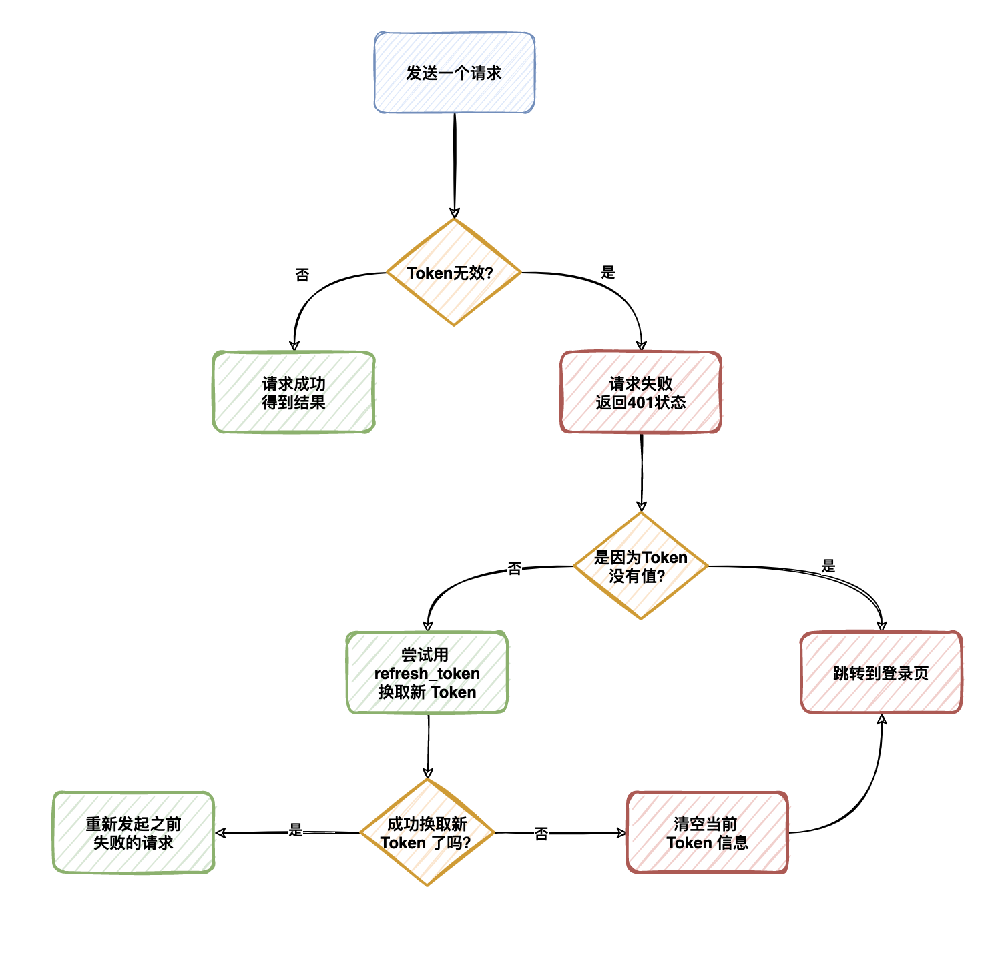

# 个人中心

## 页面结构

**目标**：能够根据模板搭建个人中心页面结构
**步骤**：

1. 根据模板修改 Profile 页面结构

## 获取用户信息并展示

1. 发送请求获取用户信息
2. 将用户信息存储到redux中
3. 页面分发获取用户信息的action
4. 获取用户信息并展示

1. 导入分发 action 的函数和获取用户信息的 action
2. 在进入该页面时就分发动作获取用户信息

### 发送请求获取用户信息

**目标**：能够发送请求获取用户信息
**分析说明**：

在使用 TS 开发与接口相关功能时，推荐按照以下步骤：

1. 先按照接口的返回数据，准备 TS 类型
2. 然后，在发送请求时，指定该请求的返回值类型

这样，在接下来的操作中，如果需要用到接口的数据，都会有类型提示了。
如果将来后端接口返回的数据变了，只需要修改对应的 TS 类型，然后，所有用到该类型的地方如果有问题，都会自动提示出来。也就是：有利于项目代码的重构和修改。

**步骤**：

1. 根据接口准备所需类型
2. 创建 actions/profile.ts 文件
3. 创建获取用户信息的 action

**核心代码**：

types/data.d.ts 中：

```ts
// 我的 - 个人信息
export type User = {
  id: string
  name: string
  photo: string
  art_count: number
  follow_count: number
  fans_count: number
  like_count: number
}
```

actions/profile.ts 中：

```ts
import { ApiResponse, User } from '@/types/data'
import { RootThunkAction } from '@/types/store'
import request from '@/utils/request'

export function getUser(): RootThunkAction {
  return async (dispatch) => {
    const res = await request.get<ApiResponse<User>>('/user')
    console.log(res)
  }
}

```

### 页面分发获取用户信息的action

**目标**：能够在我的页面中分发获取用户信息的action
**核心代码**：

Profile/index.tsx 中：

```tsx
import { useDispatch } from 'react-redux'
import { useEffect } from 'react'
import { getUser } from '@/store/actions/profile'

const Profile = () => {
  const history = useHistory()

  const dispatch = useDispatch()

  useEffect(() => {
    dispatch(getUser())
  }, [dispatch])
  // ....
}
```

配置请求拦截器 utils/request.ts

```tsx
// 添加请求拦截器
instance.interceptors.request.use(
  function (config) {
    // 在发送请求之前做些什么
    const token = getToken()
    if (token.token) {
      config.headers!.Authorization = `Bearer ${token.token}`
    }
    return config
  },
  function (error) {
    // 对请求错误做些什么
    return Promise.reject(error)
  }
)

```

### 将用户信息存储到redux中

**目标**：能够将用户信息保存到redux中
**步骤**：

1. 准备保存状态到redux的action类型
2. 在获取个人信息的 action 中将用户信息存储到redux中
3. 创建 reducers/profile.ts，并完成存储用户信息的功能
4. 在 reducers/index.ts 中，将 profile 合并到根 reducer 中

**核心代码**：

types/store.d.ts 中：

```ts
import { Token, User } from './data'

// 将 ProfileAction 联合到 redux action 类型中
type RootAction = LoginAction | ProfileAction

export type ProfileAction = {
  type: 'profile/getUser'
  payload: User
}
```

actions/profile.ts 中：

```ts
// 我的页面 - 获取个人信息
export const getUser = (): RootThunkAction => {
  return async (dispatch) => {
    const res = await request.get<UserResponse>('/user')
    
    
    const { data } = res.data
    dispatch({
      type: 'profile/getUser',
      payload: data,
    })
  }
}
```

reducers/profile.ts 中：

```ts
import { User } from '@/types/data'
import { ProfileAction } from '@/types/store'
type ProfileState = {
  user: User
}

const initialState = {
  user: {},
} as ProfileState

const profile = (state = initialState, action: ProfileAction): ProfileState => {
  switch (action.type) {
    case 'profile/getUser':
      return {
        ...state,
        user: action.payload,
      }
    default:
      return state
  }
}

export default profile

```

reducers/index.ts 中：

```ts
import profile from './profile'

const rootReducer = combineReducers({
  // ...
  profile
})
```

### 获取用户信息并展示

**目标**：能够展示用户信息
**步骤**：

1. 导入 useSelector
2. 调用 useSelector 获取 user 状态
3. 从 user 对象中解构出用户数据并展示在页面中

**核心代码**：

```tsx
const user = useSelector((state: RootState) => state.profile.user)

<div className="profile">
  {/* 个人信息 */}
  <div className="user-info">
    <div className="avatar">
      
    </div>
    <div className="user-name">{user.name}</div>
    <Link to="/profile/edit">
      个人信息 <Icon type="iconbtn_right" />
    </Link>
  </div>

  {/* 今日阅读 */}
  <div className="read-info">
    <Icon type="iconbtn_readingtime" />
    今日阅读
    <span>10</span>
    分钟
  </div>

  {/* 动态 - 对应的这一行 */}
  <div className="count-list">
    <div className="count-item">
      <p>{user.art_count}</p>
      <p>动态</p>
    </div>
    <div className="count-item">
      <p>{user.like_count}</p>
      <p>关注</p>
    </div>
    <div className="count-item">
      <p>{user.fans_count}</p>
      <p>粉丝</p>
    </div>
    <div className="count-item">
      <p>{user.follow_count}</p>
      <p>被赞</p>
    </div>
  </div>
```

## 个人信息-页面结构

**目标**：能够根据模板展示个人信息页面
**步骤**：

1. 将模板拷贝到 Profile 目录中
2. 在 App.tsx 中配置个人信息页面的路由
3. 统一调整 TabBar、List 的样式

**核心代码**：

App.tsx 中：

```tsx
import ProfileEdit from './pages/Profile/Edit'

const App = () => {
  return (
    // ...
    <Route path="/profile/edit">
      <ProfileEdit />
    </Route>
  )
}
```

App.scss 中：

```scss
.adm-list-default {
  border: none;
  font-size: 16px;
}
.adm-nav-bar-title {
  font-size: 17px;
}
.adm-nav-bar-back-arrow {
  font-size: 17px;
}
```

## 个人信息-获取并展示个人信息

**目标**：能够获取并展示编辑时的个人信息
**步骤**：

1. 在 types/data.d.ts 中，根据接口准备好返回数据类型
3. 在 actions/profile.ts 中，创建获取编辑时个人信息的 action
4. 在 types/store.d.ts 中，创建相应的 redux action 类型
5. 在 actions 中分发修改 redux 状态的 action
6. 在 reducers 中处理该 action，并将状态存储到 redux 中

**核心代码**：

types/data.d.ts 中：

```ts
export type UserProfile = {
  id: string
  photo: string
  name: string
  mobile: string
  gender: number
  birthday: string
  intro: string
}

```

actions/profile.ts 中：

```ts
import { ApiResponse, User, UserProfile } from '@/types/data'

export const getUserProfile = (): RootThunkAction => {
  return async dispatch => {
    const res = await request.get<ApiResponse<UserProfile>>('/user/profile')
    dispatch({ type: 'profile/getUserProfile', payload: res.data.data })
  }
}
```

types/store/d.ts 中：

```ts
import { Token, User, UserProfile } from './data'
export type ProfileAction =
  // ...
  | {
      type: 'profile/getUserProfile'
      payload: UserProfile
    }
```

reducers/profile.ts 中：

```ts
// 注意：以下代码为简化代码

import { UserProfile } from '@/types/data'

type ProfileState = {
  // ...
  userProfile: UserProfile
}

const initialState = {
  // ...
  userProfile: {}
} as ProfileState

const profile = (state = initialState, action: ProfileAction): ProfileState => {
  switch (action.type) {
    // ...
    case 'profile/getUserProfile':
      return {
        ...state,
        userProfile: action.payload
      }
  }
}
```

Profile/Edit/index.tsx 中：

```tsx
import { useEffect } from 'react'
import { useDispatch, useSelector } from 'react-redux'
import { getUserProfile } from '@/store/actions'
import type { RootState } from '@/types/store'

const ProfileEdit = () => {
  const dispatch = useDispatch()
  const { userProfile } = useSelector((state: RootState) => state.profile)

  useEffect(() => {
    dispatch(getUserProfile())
  }, [dispatch])


<div className="wrapper">
  {/* 列表 */}
  <List className="profile-list">
    {/* 列表项 */}
    <Item
      extra={
        <span className="avatar-wrapper">
          
        </span>
      }
      arrow
    >
      头像
    </Item>
    <Item arrow extra={userProfile.name}>
      昵称
    </Item>
    <Item
      arrow
      extra={
        <span
          className={classNames('intro', userProfile.intro && 'normal')}
        >
          {userProfile.intro || '未填写'}
        </span>
      }
    >
      简介
    </Item>
  </List>

  <List className="profile-list">
    <Item arrow extra={userProfile.gender === 0 ? '男' : '女'}>
      性别
    </Item>
    <Item arrow extra={userProfile.birthday}>
      生日
    </Item>
  </List>

```

## 自定义hooks基本语法

**目标**：能够知道什么是自定义hooks
**分析说明**：

除了使用 React 提供的 hooks 之外，开发者还可以创建自己的 hooks，也就是自定义 hooks。
问题：为什么要创建自定义 hooks？
回答：**实现状态逻辑复用**，也就是将与状态相关的逻辑代码封装到一个函数中，哪个地方用到了，哪个地方调用即可。
自定义 hooks 的特点：

1. 名称必须以 `use` 开头
2. 和内置的 React Hooks 一样，自定义 hooks 也是一个函数

```ts
// 创建自定义 hooks 函数
const useXxx = (params) => {
  // ...
  // 需要复用的状态逻辑代码
  // ...

  return xxx
}

// 使用自定义 hooks 函数
const Hello = () => {
  const xxx = useXxx(...)
}
```

- 说明：自定义 hooks 就是一个函数，可以完全按照对函数的理解，来理解自定义 hooks
  - 比如：参数和返回值都可以可选的，可以提供也可以不提供。根据实际的需求来实现即可。

**总结**：

1. 自定义 hooks 是函数吗？
2. 自定义 hooks 的名称有什么约束？
3. 自定义 hooks 可以没有参数或返回值吗？

## 封装自定义hooks-分析要封装的代码逻辑

**目标**：能够封装自定义hooks实现进入页面就获取数据的逻辑复用

1. 分析要封装的代码逻辑
2. 实现自定义hooks（不考虑类型）
3. 为实现的自定义hooks添加类型

**目标**：分析要封装的代码逻辑找到相同点和不同点
**分析说明**：

函数封装的基本思想：将相同的逻辑直接拷贝到函数中，不同的逻辑通过函数参数传入。需要返回数据，就通过函数返回值返回

分析以上内容，有两个不同点：

1. 分发的 action 函数不同
2. 获取的状态不同

所以，只需要把这两点作为自定义 hooks 的**参数**即可。
这两个功能最终的目的，都是为了拿到相应的应用状态。因此，把拿到的应用状态，作为自定义 hooks 的**返回值**即可。

```js
const useInitialState = (action, stateName) => {
  // 需要复用的状态逻辑代码

  return state
}

// 使用自定义 hooks：
const { userProfile } = useInitialState(getUserProfile, 'profile')


const { user } = useInitialState(getUser, 'profile')

```

## 封装自定义hooks-实现自定义hooks（不考虑类型）

**目标**：能够通过JS代码实现自定义hooks
**步骤**：

1. 创建 utils/hooks.ts 文件
2. 创建 useInitialState 函数（自定义 hook）
3. 导入用到的包
4. 将相同的逻辑，直接封装到 useInitialState 函数中
5. 将不同的地方，作为 useInitialState 函数的参数
6. 将拿到的状态作为 useInitialState 函数的返回值

**核心代码**：

utils/use-initial-state.ts 中：

```ts
// 导入用到的包
import { useEffect } from 'react'
import { useDispatch, useSelector } from 'react-redux'
import type { RootState } from '@/types/store'

// 创建 useInitialState 函数（自定义 hook）
const useInitialState = (action: any, stateName: any) => {
  const dispatch = useDispatch()
  const state = useSelector(state: any => state[stateName])

  useEffect(() => {
    dispatch(action())
  }, [dispatch, action])

  return state
}

export { useInitialState }
```

Profile/Edit.tsx 中：

```tsx
import { useInitialState } from '@/utils/use-initial-state'

const ProfileEdti = () => {
  const { userProfile } = useInitialState(getUserProfile, 'profile')
  // ...
}
```

## 封装自定义hooks-为实现的自定义hooks添加类型

**目标**：能够为实现的自定义hooks添加类型
**分析说明**：

对于 useInitialState 这个自定义 hook 来说，只需要为参数指定类型即可。

1. 参数 action：就是一个函数，所以，直接指定为最简单的函数类型即可
2. 参数 stateName：
  - stateName 表示从 Redux 状态中取出的状态名称，比如，`'profile'`
  - 所以，stateName 应该是 RootState 中的所有状态名称中的任意一个
  - 但是，具体是哪一个不确定，只有在使用该函数时才能确定下来。
  - 问题：如果一个类型不确定，应该是什么 TS 中的什么类型来实现？

**核心代码**：

utils/use-initial-state.ts 中：

```tsx
// 导入用到的包
import { useEffect } from 'react'
import { useDispatch, useSelector } from 'react-redux'
import type { RootState } from '@/types/store'

// 创建 useInitialState 函数（自定义 hook）
export function useInitialState<StateName extends keyof RootState>(
  action: () => void,
  stateName: StateName
) {
  const dispatch = useDispatch()
  const state = useSelector((state: RootState) => state[stateName])

  useEffect(() => {
    dispatch(action())
  }, [dispatch, action])

  return state
}

```

## 封装自定义hooks-应用

**目标**：能够使用封装好的自定义hook改造获取个人信息功能
**步骤**：

1. 导入自定义hook
2. 调用自定义hook，并传入相应的参数，验证是否有明确的类型提示
3. 通过返回值，拿到对应的状态

**核心代码**：

Profile/Edit/index.tsx 中：

```tsx
import { useInitialState } from '@/utils/use-initial-state'

const ProfileEdit = () => {
  const { userProfile } = useInitialState(getUserProfile, 'profile')

  // ...
}
```

## 修改昵称和简介-准备弹层并控制显示

+ 准备弹层

```tsx
import { Button, List, NavBar, Popup } from 'antd-mobile'

<Popup visible={showInput.visible} position="right">
  <div style={{ width: '100vw' }}>啦啦</div>
</Popup>
```

+ 准备状态，用于控制弹层的显示

```tsx
type InputState = {
  visible: boolean
  type: '' | 'name' | 'intro'
}
const [showInput, setShowInput] = useState<InputState>({
  type: '',
  visible: false
})
```

+ 点击昵称和简介的时候，需要显示弹层

```tsx
<Item
  arrow
  extra={userProfile.name}
  onClick={() =>
    setShowInput({
      visible: true,
      type: 'name'
    })
  }
>
  昵称
</Item>

<Item
  arrow
  onClick={() =>
    setShowInput({
      visible: true,
      type: 'intro'
    })
  }
  extra={
    <span
      className={classNames('intro', userProfile.intro && 'normal')}
    >
      {userProfile.intro || '未填写'}
    </span>
  }
>
  简介
</Item>
```


## 修改昵称和简介-隐藏弹层

**目标**：能够在修改昵称组件点击返回时隐藏
**分析说明**：

Edit 组件和 EditInput 组件之间是父子组件的关系。
目标是通过 EditInput 子组件来隐藏弹出层，也就是在子组件中修改父组件中的状态。
所以，此处通过**子到父的组件通讯**来解决

**步骤**：

1. 在 Edit 组件中，创建一个控制弹出层隐藏的函数
2. 将该函数作为属性传递给子组件 EditInput
3. 在 EditInput 子组件中，通过 props 接收该属性
4. 为 EditInput 组件的 props 指定类型
5. 在点击导航栏返回按钮时，调用该关闭函数即可

**核心代码**：

Edit/index.tsx 中：

```tsx
// 关闭弹层
const hideInput = () => {
  setShowInput({
    type: '',
    visible: false
  })
}

<EditInput hideInput={hideInput}></EditInput>
```

Edit/components/EditInput/index.tsx 中：

```tsx
type Props = {
  hideInput: () => void
}
const EditInput = ({ hideInput }: Props) => {
    <NavBar
      className="navbar"
      right={<span className="commit-btn">提交</span>}
      onBack={hideInput}
    >
      编辑昵称
    </NavBar>
}
```

## 修改昵称和简介-修改标题文字

+ 传递type属性

```tsx
<EditInput hideName={hideName} type={showInput.type}></EditInput>
```

+ 根据type控制内容的显示和隐藏

```tsx
import { Input, NavBar, TextArea } from 'antd-mobile'

import styles from './index.module.scss'

type Props = {
  hideName: () => void
  type: '' | 'name' | 'intro'
}
const EditInput = ({ hideName, type }: Props) => {
  return (
    <div className={styles.root}>
      <NavBar
        className="navbar"
        right={<span className="commit-btn">提交</span>}
        onBack={() => hideName()}
      >
        编辑{type === 'name' ? '昵称' : '简介'}
      </NavBar>

      <div className="edit-input-content">
        <h3>编辑{type === 'name' ? '昵称' : '简介'}</h3>

        {type === 'name' ? (
          <div className="input-wrap">
            <Input placeholder="请输入昵称" />
          </div>
        ) : (
          <TextArea
            className="textarea"
            placeholder="请输入简介"
            showCount
            maxLength={99}
          />
        )}
      </div>
    </div>
  )
}

export default EditInput

```

## 修改昵称和简介-数据回显

**目标**：能够在弹出层文本框中展示昵称或者简介

**核心代码**：

Edit/components/EditInput/index.tsx 中：

```tsx
const { userProfile } = useSelector((state: RootState) => state.profile)
const [value, setValue] = useState(
  type === 'name' ? userProfile.name : userProfile.intro
)

{type === 'name' ? (
  <div className="input-wrap">
    <Input
      placeholder="请输入昵称"
      value={value}
      onChange={(e) => setValue(e)}
      maxLength={11}
    />
  </div>
) : (
  <TextArea
    className="textarea"
    placeholder="请输入简介"
    showCount
    maxLength={99}
    value={value}
    onChange={(e) => setValue(e)}
  />
)}
```

## 修改昵称和简介-关闭弹层bug

+ 默认情况，关闭弹层之后，数据回显还在，导致昵称和简介回显错乱
+ `destroyOnClose`可以保证关闭弹层时销毁组件

```tsx
<Popup
  visible={showName.visible}
  bodyStyle={{ height: '100%' }}
  position="right"
  destroyOnClose
>
  <EditInput hideName={hideName} type={showName.type}></EditInput>
</Popup>
```

## 修改昵称和简介-自动获取光标

+ 创建2个ref

```jsx
const inputRef = useRef<InputRef>(null)
const textRef = useRef<TextAreaRef>(null)


<Input
  placeholder="请输入昵称"
  value={value}
  onChange={(e) => setValue(e)}
  ref={inputRef}
/>

<TextArea
  className="textarea"
  placeholder="请输入简介"
  showCount
  maxLength={99}
  value={value}
  onChange={(e) => setValue(e)}
  ref={textRef}
/>
```

+ 使用useEffect保证组件渲染的时候自动获取焦点

```tsx
useEffect(() => {
  if (type === 'name') {
    inputRef.current?.focus()
  } else {
    textRef.current?.focus()
    document.querySelector('textarea')?.setSelectionRange(-1, -1)
  }
}, [type])
```

## 修改昵称和简介-回传给父组件

**目标**：能够在点击提交时拿到昵称并回传给父组件
**分析说明**：

用户个人信息的状态是在 Edit 父组件中拿到的，所以，修改用户个人信息也应该由 Edit 父组件发起。
因此，需要将修改后的昵称回传给 Edit 父组件。

**步骤**：

1. 为 EditInput 组件添加 onUpdate函数属性
2. 在 Edit 组件中为 EditInput 组件传递 onUpdate属性
3. 为提交按钮绑定点击事件
4. 在点击事件中，调用父组件传递过来的 onUpdate 函数，将昵称回传给父组件

**核心代码**：

Edit/index.tsx 中：

```tsx
const onUpdate = (key: string, value: string) => {
  console.log(key, value)
}


<EditInput
  hideInput={hideInput}
  type={showInput.type}
  onUpdate={onUpdate}
></EditInput>
```

Edit/components/EditInput/index.tsx 中：

```tsx
// 接收onUpdate
type Props = {
  hideName: () => void
  type: string
  onUpdate: (key: string, value: string) => void
}

<span className="commit-btn" onClick={() => onUpdate(type, value)}>
  提交
</span>
```

## 修改昵称和简介-发送请求修改

actions/profile.ts 中：

```tsx
export function updateUserProfile(key: string, value: string): RootThunkAction {
  return async (dispatch) => {
    await request.patch('/user/profile', {
      [key]: value
    })
    // 重新渲染
    dispatch(getUserProfile())
  }
}
```

pages/Profile/Edit/index.tsx

```tsx
const onUpdate = async (key: string, value: string) => {
  await dispatch(updateUserProfile(key, value))
  Toast.show({
    icon: 'success',
    content: '修改成功'
  })
  hideInput()
}
```


## 修改性别和头像-准备弹出层

**目标**：能搞显示修改性别弹出层
**步骤**：

1. 将准备好的修改性别的模板拷贝到 components 目录中
2. 导入修改性别组件，在 Popup 组件中渲染

**核心代码**：

Edit/index.tsx 中：

```tsx
import EditList from './components/EditList'

const ProfileEdit = () => {
  return (
    // ...
    <Popup visible={true}>
      <EditList />
    </Popup>
  )
}
```

## 修改性别和头像-控制弹层的显示隐藏

**目标**：能搞控制修改性别弹出层的展示或隐藏
**分析说明**：

修改性别和修改头像的弹出层内容几乎是一样的，因此，也可以复用同一个弹出层组件。
因此，接下来要从**复用**的角度，设计修改性别弹出层的逻辑（可以参考刚刚实现的修改昵称和简介）。

**步骤**：

1. 准备用于控制修改性别弹出层的状态
2. 为性别添加点击事件，在点击事件中修改状态进行展示
3. 创建隐藏弹出层的控制函数，在点击遮罩时关闭弹出层，并传递给 EditList 组件
4. 为 EditList 组件添加 props 类型，并接收隐藏函数
5. 为取消按钮添加点击事件来触发隐藏弹出层

**核心代码**：

Edit/index.tsx 中：

```tsx
  type ListState = {
    visible: boolean
    type: '' | 'gender' | 'photo'
  }
  const [showList, setShowList] = useState<ListState>({
    visible: false,
    type: ''
  })


const hideList = setShowList({
  type: '',
  visible: false,
})

<Popup visible={showList.visible} destroyOnClose onMaskClick={hideList}>
  <EditList type={showList.type} hideList={hideList} />
</Popup>
    
// 点击显示
<Item
  extra={
    <span className="avatar-wrapper">
      
    </span>
  }
  arrow
  onClick={() =>
    setShowList({
      visible: true,
      type: 'photo',
    })
  }
>
  头像
</Item>
    
<Item
  arrow
  onClick={() => setShowList({ visible: true, type: 'gender' })}
  extra={userProfile.gender === 0 ? '男' : '女'}
>
  性别
</Item>
```

EditList/index.tsx 中：

```tsx
type Props = {
  onClose: () => void
}

const EditList = ({ onClose }: Props) => {
  return (
    <div className="list-item" onClick={onClose}>
      取消
    </div>
  )
}


```

## 修改性别和头像-区分头像和性别

- 父组件把type传给子组件

```tsx
<EditList hideList={hideList} type={showList.type}></EditList>
```

+ 子组件根据type属性控制需要显示的内容

```tsx
import styles from './index.module.scss'

type Props = {
  hideList: () => void
  type: '' | 'gender' | 'photo'
}

const genderList = [
  { title: '男', value: '0' },
  { title: '女', value: '1' }
]

const photoList = [
  { title: '拍照', value: '' },
  { title: '本地选择', value: '' }
]

const EditList = ({ hideList, type }: Props) => {
  const list = type === 'gender' ? genderList : photoList
  return (
    <div className={styles.root}>
      {list.map((item) => (
        <div key={item.title} className="list-item">
          {item.title}
        </div>
      ))}

      <div className="list-item" onClick={hideList}>
        取消
      </div>
    </div>
  )
}

export default EditList

```

## 修改性别和头像-修改性别功能

+ 父组件把onUpdate传递给子组件

```tsx
  const onUpdate = async (key: string, value: string) => {
    await dispatch(updateUserProfile(key, value))
    Toast.show({
      icon: 'success',
      content: '修改成功'
    })
    hideInput()
    hideList()
  }


<EditList
  hideList={hideList}
  type={showList.type}
  onUpdate={onUpdate}
></EditList>
```

+ 子组件注册点击事件

```tsx
type Props = {
  hideList: () => void
  type: '' | 'gender' | 'photo'
  onUpdate: (key: string, value: string) => void
}

<div
  key={item.title}
  className="list-item"
  onClick={() => onUpdate(type, item.value)}
>
  {item.title}
</div>
```


## 修改头像-弹窗选择图片

**目标**：能够在点击拍照或本地选择时弹窗选择图片

**核心代码**：

Edit/index.tsx 中：

```tsx
const fileRef = useRef<HTMLInputElement>(null)


<input type="file" hidden ref={fileRef} />

    

const onUpdate = async (key: string, value: string) => {
  if (key === 'photo') {
    // 需要修改头像
    fileRef.current!.click()
    return
  }
  await dispatch(updateUserProfile(key, value))
  Toast.show({
    icon: 'success',
    content: '修改成功'
  })
  hideInput()
  hideList()
}

```

## 修改头像-组装修改头像的数据

**目标**：能够组装修改头像需要的数据
**步骤**：

1. 创建函数，监听 `input[type=file]` 选择文件的变化 change
2. 在函数中，创建 FormData 对象
3. 根据接口，拿到接口需要规定的参数名，并将选择的文件添加到 FormData 对象中

**核心代码**：

Edit/index.tsx 中：

```tsx
const ProfileEdit = () => {
    const changePhoto = (e: React.ChangeEvent<HTMLInputElement>) => {
      // 获取选择的文件
      const file = e.target.files![0]
      // 需要上传这张图片
      const fd = new FormData()
      fd.append('photo', file)
      // 发送请求
    }

  return (
    // ...
    <input type="file" onChange={onChangePhoto} />
  )
}
```

## 修改头像-更新头像

**目标**：能够实现更新头像
**步骤**：

1. 在 Edit 组件中，分发修改头像的 action，传入 FormData 对象，并关闭弹出层
3. 在 actions 中，创建修改头像的 action，接收到传递过来的 FormData 对象
4. 发送请求，更新用户头像
5. 分发 action 重新渲染

**核心代码**：

Edit/index.tsx 中：

```tsx
  const changePhoto = async (e: React.ChangeEvent<HTMLInputElement>) => {
    // 获取选择的文件
    const file = e.target.files![0]
    // 需要上传这张图片
    const fd = new FormData()
    fd.append('photo', file)
    // 发送请求
    await dispatch(updateUserPhoto(fd))
    Toast.show({
      icon: 'success',
      content: '修改头像成功'
    })
    hideList()
  }
```

actions/profile.ts 中：

```ts
export function updateUserPhoto(fd: FormData): RootThunkAction {
  return async (dispatch) => {
    await request.patch('/user/photo', fd)
    dispatch(getUserProfile())
  }
}

```

## 修改生日-展示日期选择器

**目标**：能够在点击生日时展示日期选择器
**步骤**：

1. 创建状态 showBirthday 用来控制日期选择器的展示或隐藏
2. 将 showBirthday 设置为日期选择器的 visible 属性
3. 给生日绑定点击事件，在点击事件中修改 showBirthday 值为 true 来展示日期选择器
4. 为日期选择器设置 value，值为用户的生日值
5. 在日期选择器关闭的回调中，隐藏日期选择器

**核心代码**：

Edit/index.tsx 中：

```tsx
const ProfileEdit = () => {
  const [showBirthday, setShowBirthday] = useState(false)

  const onBirthdayShow = () => {
    setShowBirthday(true)
  }
  const onBirthdayHide = () => {
    setShowBirthday(false)
  }

  return (
    // ...
    <Item arrow extra={birthday} onClick={onBirthdayShow}>
      生日
    </Item>

    <DatePicker
      visible={showBirthday}
      value={new Date(birthday)}
      onCancel={onBirthdayHide}
      title="选择年月日"
      min={new Date('1900-01-01')}
      max={new Date()}
      onConfirm={(val) => {
          onUpdate('birthday', dayjs(val).format('YYYY-MM-DD'))
        }}
    />
  )
}
```

## 退出登录-弹窗确认

**目标**：能够点击退出按钮时弹窗确认是否退出
**分析说明**：

不需要自定义样式的情况下，使用 `Dialog.confirm` 来弹窗确认即可。
如果需要自定义弹窗按钮的样式，需要使用 `Dialog.show` 基础方法来实现。

**步骤**：

1. 为退出登录按钮绑定点击事件
2. 在点击事件中，使用 Dialog 弹窗让用户确认是否退出登录

**核心代码**：

Edit/index.tsx 中：

```tsx
const logoutFn = () => {
  Dialog.show({
    title: '温馨提示',
    content: '你确定要退出吗？',
    closeOnAction: true,
    actions: [
      [
        {
          key: 'cancel',
          text: '取消',
          style: {
            color: 'blue'
          }
        },
        {
          key: 'confirm',
          text: '确定',
          danger: true,
          bold: true,
          onClick: () => {
            // 1. 清除token
            dispatch(logout())
            // 2. 跳转到登录
            history.push('/login')
            // 3. 给一个提示消息
            Toast.show({
              icon: 'success',
              content: '退出成功'
            })
          }
        }
      ]
    ]
  })
}
```

## 退出登录-功能完成

**目标**：能够实现退出功能
**步骤**：

1. 为退出按钮，绑定点击事件，在点击事件中分发退出 action
2. 在 types 中，创建退出登录的 action 类型
3. 在 actions/login.ts 中，创建退出 action
4. 在退出 action 中，分发退出 action，并清理 token
5. 在 reducers 中，处理退出 action 清空 token
6. 返回登录页面

**核心代码**：

Edit/index.tsx 中：

```tsx
const onLogout = () => {
  Dialog.show({
    actions: [
      [
        {
          text: '退出',
          onClick: () => {
            dispatch(logout())
            history.replace('/login')
          }
        }
      ]
    ]
  })

  // ...
}
```

types/data.d.ts 中：

```ts
// 登录 action 类型
export type LoginAction =
  | {
      type: 'login/token'
      payload: Token
    }
  | {
      type: 'login/logout'
    }
```

actions/login.ts 中：

```ts
export function logout(): LoginAction {
  removeToken()
  return {
    type: 'login/logout'
  }
}

```

reducers/login.ts 中：

```ts
if (action.type === 'login/logout') {
  return {
    token: '',
    refresh_token: ''
  }
}
```

## 封装鉴权路由组件

**目标**：能够封装鉴权路由组件实现登录访问控制功能

> https://v5.reactrouter.com/web/example/auth-workflow

**步骤**：

1. 在 components 目录中创建 PrivateRoute 路由组件
2. 在 PrivateRoute 组件中，实现路由的登录访问控制逻辑
3. 未登录时，重定向到登录页面，并传递要访问的路由地址
4. 登录时，直接渲染要访问的路由

**核心代码**：

components/AuthRoute.tsx 中：

```tsx
import { hasToken } from '@/utils/storage'
import { Route, Redirect, RouteProps } from 'react-router-dom'

export default function PrivateRoute({ children, ...rest }: RouteProps) {
  return (
    <Route
      {...rest}
      render={({ location }) =>
        hasToken() ? (
          children
        ) : (
          <Redirect
            to={{
              pathname: '/login',
              state: { from: location.pathname }
            }}
          />
        )
      }
    />
  )
}

```

App.tsx 中：

```tsx
import { PrivateRoute } from './components/AuthRoute'

const App = () => {
  return (
    // ...
    <PrivateRoute path="/profile/edit">
      <ProfileEdit />
    </PrivateRoute>
  )
}
```

pages/Layout/index.tsx 中：

```tsx
import { AuthRoute } from '@/components/AuthRoute'

const Layout = () => {
  // ...
  return (
    // ...
    <PrivateRoute path="/home/profile">
      <Profile></Profile>
    </PrivateRoute>
  )
}
```

## 登录时跳转到相应页面

**目标**：能够在登录时根据重定向路径跳转到相应页面
**步骤**：

1. 在 Login 组件中导入 useLocation 来获取路由重定向时传入的 state
2. 调用 useLocation hook 时，指定 state 的类型
3. 登录完成跳转页面时，判断 state 是否存在
4. 如果存在，跳转到 state 指定的页面
5. 如果不存在，默认跳转到首页

**核心代码**：

pages/Login/index.tsx 中：

```tsx
import { useLocation } from 'react-router-dom'

const Login = () => {
  // 注意： state 可能是不存在的，所以，类型中要明确包含不存在的情况，即 undefined
  const location = useLocation<{ from: string }>()

  afterClose() {
      // history.push('/home')
      let pathname = location.state ? location.state.from : '/home'
      history.replace(pathname)
    }
}
```

## 理解无感刷新token

**目标**：能够理解什么是无感刷新token
**分析说明**：

一般情况下，我们用到的移动端的 App（比如，微信）只要登录过一次，一般就不需要再次重新登录，除非很长时间没有使用过 App。
这是如何做到的呢？这就用到我们要讲的无感刷新token了。

我们知道，登录时会拿到一个登录成功的标识 token（身份令牌），有了这个令牌就可以进行登录后的操作了，比如，获取个人资料、修改个人信息等等
但是，为了安全，登录标识 token 一般都是有有效期的，比如，咱们的极客园项目中 token 的有效期是 2 个小时。
如果不进行额外的处理，登录后，2小时以后，就得再次登录才可以。但是，这种用户体验不好，特别是移动端（不管是 App 还是 H5）。
相对来说，更好的用户体验是前面提到的微信的那种方式，它的原理简单来说是这样的：

在登录时，同时拿到两个 token：

1 登录成功的令牌：`token` 
2 刷新 token 的令牌：`refresh_token`

刷新 token 的令牌用来：在 token 过期后，换取新的 token（续费），从而实现“永久登录”效果。
这就是所谓的：**无感刷新token**。

常用的处理流程：



思想总结：

- 无 Token，直接跳到登录页
- 有 Token，则用 Refresh Token 换新 Token：换成功则用新 Token 重发原先的请求，没换成功则跳到登录页


## 实现无感刷新token-换取新的token

**目标**：能够实现无感刷新token实现自动登录
**分析说明**：

概述：在登录超时或者 token 失效时，也就是服务器接口返回 401，通过 refresh_token 换取新的 token
过程如下（以获取个人资料数据为例）：

```text
【1】发送请求获取个人资料数据
【2】接口返回 401，也就是 token 失效了
【3】在响应拦截器中统一处理，换取新的 token
【4】将新的 token 存储到本地缓存中
【5】**继续发送获取个人资料的请求，完成数据获取** - 关键点
【6】如果整个过程中出现了任意异常，一般来说就是 refresh_token 也过期了，换取 token 失败，此时，要进行错误处理，也就是： 清除 token，跳转到登录页面
```

axios 请求拦截过程说明：

```text
1 axios.get()
2 请求拦截器
3 响应代码
4 响应拦截器

以上 4 个步骤的执行顺序：

【1 axios.get()】 --> 【2 请求拦截器】>>> 服务器处理 >>> 【4 响应拦截器】 --> 【3 响应代码】
```

**步骤**：

1. 使用 try-catch 处理异常，出现异常时，清除 token，清空 redux token，跳转到登录页面
2. 判断本地存储中，是否有 `refresh_token`
3. 如果没有，直接跳转到登录页面，让用户登录即可
4. 如果有，就使用 `refresh_token` 来通过 **axios** 发送请求，换取新的 token
5. 将新获取到的 token 存储到本地缓存中和 redux 中
6. 继续发送原来的请求

**核心代码**：

utils/request.ts 中：

```ts

// 添加响应拦截器
request.interceptors.response.use(
  function (response) {
    // 对响应数据做点什么
    return response
  },
  async function (error: AxiosError<{ message: string }>) {
    // 对响应错误做点什么
    if (!error.response) {
      // 网络问题
      Toast.show('网络繁忙, 请稍后重试')
      return Promise.reject(error)
    }
    if (error.response.status === 401) {
      // token过期，需要额外处理
      // 1. 获取refreshToken
      const token = getToken()

      // 2. 判断是否有refresh_token
      if (!token.refresh_token) {
        // 没有刷新token
        history.replace('/login', {
          from: history.location.pathname
        })
        Toast.show('登录信息过期')
        return Promise.reject(error)
      }

      // 3. 使用refresh_token去换取新的token
      try {
        const res = await axios.request<ApiResponse<{ token: string }>>({
          method: 'put',
          url: '/authorizations',
          baseURL,
          headers: {
            Authorization: `Bearer ${token.refresh_token}`
          }
        })
        // 把新的token存储到redux中
        store.dispatch(
          saveToken({
            token: res.data.data.token,
            refresh_token: token.refresh_token
          })
        )

        // 重新发送请求
        return request.request(error.config)
      } catch {
        // 刷新token失败
        history.replace('/login', {
          from: history.location.pathname
        })
        Toast.show('登录信息失效')
        store.dispatch(logout())

        return Promise.reject(error)
      }
    }
    Toast.show(error.response.data.message)
    return Promise.reject(error)
  }
)

```
