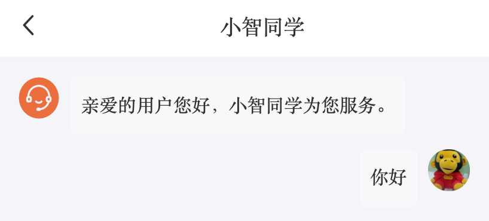

# 小智同学

## 为什么需要websocket

> WebSocket 是一种数据通信协议，类似于我们常见的 http 协议。

初次接触 WebSocket 的人，都会问同样的问题：我们已经有了 HTTP 协议，为什么还需要另一个协议？它能带来什么好处？

答案很简单，因为 HTTP 协议有一个缺陷：通信只能由客户端发起。http基于请求响应实现。

举例来说，我们想了解今天的天气，只能是客户端向服务器发出请求，服务器返回查询结果。HTTP 协议做不到服务器主动向客户端推送信息。

这种单向请求的特点，注定了如果服务器有连续的状态变化，客户端要获知就非常麻烦。我们只能使用["轮询"](https://www.pubnub.com/blog/2014-12-01-http-long-polling/)：每隔一段时候，就发出一个询问，了解服务器有没有新的信息。最典型的场景就是聊天室。

轮询的效率低，非常浪费资源（因为必须不停连接，或者 HTTP 连接始终打开）。因此，工程师们一直在思考，有没有更好的方法。WebSocket 就是这样发明的。

## websocket简介

WebSocket 协议在2008年诞生，2011年成为国际标准。所有浏览器都已经支持了。

它的最大特点就是，服务器可以主动向客户端推送信息，客户端也可以主动向服务器发送信息，是真正的双向平等对话，属于[服务器推送技术](https://en.wikipedia.org/wiki/Push_technology)的一种。

典型的websocket应用场景：

+ 即时通讯，，，客服  
+ 聊天室 广播
+ 点餐


## 静态结构

> 目标：实现小智同学页面的静态结构和样式

从素材中获取小智同学的结构与样式

## 动态渲染聊天记录列表

> 目标：将聊天数据存在数组状态中，再动态渲染到界面上

**操作步骤**

1. 声明一个数组状态

```jsx
const [messageList, setMessageList] = useState<
  {
    type: 'robot' | 'user'
    text: string
  }[]
>([
  { type: 'robot', text: '亲爱的用户您好，小智同学为您服务。' },
  { type: 'user', text: '你好' }
])
```

2. 从 Redux 中获取当前用户基本信息

```jsx
// 当前用户信息
const { user } = useInitState(getUser, 'profile')
```

3. 根据数组数据，动态渲染聊天记录列表

```jsx
{/* 聊天记录列表 */}
<div className="chat-list">
  {messageList.map((msg, index) => {
    // 机器人的消息
    if (msg.type === 'robot') {
      return (
        <div className="chat-item" key={index}>
          <Icon type="iconbtn_xiaozhitongxue" />
          <div className="message">{msg.text}</div>
        </div>
      )
    }
    // 用户的消息
    else {
      return (
        <div className="chat-item user" key={index}>
          
          <div className="message">{msg.text}</div>
        </div>
      )
    }
  })}
</div>
```

效果：




---


## 建立与服务器的连接

> 目标：使用 socket.io 客户端与服务器建立 WebSocket 长连接 

1. 安装包：`yarn add socket.io-client` 只安装客户端要使用到的包
2. 和服务器进行连接

```tsx
import io from 'socket.io-client'

// 和服务器建立了链接
const client = io('地址', {
    query: {
        token: 用户token
    },
    transports: ['websocket']
})
```

3. 和服务器进行通讯

```tsx
client.on('connect', () => {})  // 当和服务器建立连接成功，这个事件就会触发
client.on('message', () => {})  // 接收到服务器的消息，这个事件就会触发
client.on('disconnect', () => {})    // 和服务器断开链接，就会触发disconnect

// 主动给服务器发送消息
client.emit('message', 值)
// 主动关闭和服务器的链接
client.close()
```


本项目聊天客服的后端接口，使用的是基于 WebSocket 协议的 socket.io 接口。我们可以使用专门的 socket.io 客户端库，就能轻松建立起连接并进行互相通信。


实现思路：

- 借助 `useEffect`，在进入页面时调用客户端库建立 socket.io 连接

**操作步骤**

1. 安装 socket.io 客户端库：`socket.io-client`

```bash
yarn add socket.io-client
```


2. 在进入机器人客服页面时，创建 socket.io 客户端

```jsx
import io from 'socket.io-client'
import { getTokenInfo } from '@/utils/storage'
```

```jsx
// 用于缓存 socket.io 客户端实例
const clientRef = useRef<Socket | null>(null)

useEffect(() => {
  // 创建客户端实例
  const client = io('http://toutiao.itheima.net', {
    transports: ['websocket'],
    // 在查询字符串参数中传递 token
    query: {
      token: getTokenInfo().token
    }
  })

  // 监听连接成功的事件
  client.on('connect', () => {
    // 向聊天记录中添加一条消息
    setMessageList(messageList => [
      ...messageList,
      { type: 'robot', text: '我现在恭候着您的提问。' }
    ])
  })

  // 监听收到消息的事件
  client.on('message', data => {
    console.log('>>>>收到 socket.io 消息:', data)
  })

  // 将客户端实例缓存到 ref 引用中
  clientRef.current = client

  // 在组件销毁时关闭 socket.io 的连接
  return () => {
    client.close()
  }
}, [])
```


---


## 给机器人发消息

> 目标：将输入框内容通过 socket.io 发送到服务端


实现思路：

- 使用 socket.io 实例的 `emit()` 方法发送信息


**操作步骤**

1. 声明一个状态，并绑定消息输入框

```jsx
// 输入框中的内容
const [message, setMessage] = useState('')
```

```jsx
<Input
  className="no-border"
  placeholder="请描述您的问题"
  value={message}
  onChange={e => setMessage(e)}
  />
```


2. 为消息输入框添加键盘事件，在输入回车时发送消息

```jsx
<Input
	// ...
      onKeyUp={onSendMessage}
  />
```

```jsx
// 按回车发送消息
const onSendMessage = e => {
  if (e.keyCode === 13) {
    // 通过 socket.io 客户端向服务端发送消息
    clientRef.current.emit('message', {
      msg: message,
      timestamp: Date.now()
    })

    // 向聊天记录中添加当前发送的消息
    setMessageList(messageList => [
      ...messageList,
      { type: 'user', text: message }
    ])

    // 发送后清空输入框
    setMessage('')
  }
}
```


---


## 接收机器人回复的消息

> 目标：
>
> 1. 通过 socket.io 监听回复的消息，并添加到聊天列表中；
>
> 2. 且当消息较多出现滚动条时，有后续新消息的话总将滚动条滚动到最底部。


实现思路：

- 使用 socket.io 实例的 `message` 事件接收信息
- 在聊天列表数据变化时，操作列表容器元素来设置滚动量

**操作步骤**

1. 在 socket.io 实例的 `message` 事件中，将接收到的消息添加到聊天列表：

```jsx
// 监听收到消息的事件
client.on('message', (data) => {
  // 向聊天记录中添加机器人回复的消息
  setMessageList((messageList) => [
    ...messageList,
    { type: 'robot', text: data.msg },
  ])
})
```


2. 声明一个 ref 并设置到聊天列表的容器元素上

```jsx
// 用于操作聊天列表元素的引用
const chatListRef = useRef(null)
```

```jsx
<div className="chat-list" ref={chatListRef}>
```

3. 通过 `useEffect` 监听聊天数据变化，对聊天容器元素的 scrollTop 进行设置：

```jsx
// 监听聊天数据的变化，改变聊天容器元素的 scrollTop 值让页面滚到最底部
useEffect(() => {
  const current = chatListRef.current!
  current.scrollTop = current.scrollHeight
}, [messageList])
```


---

