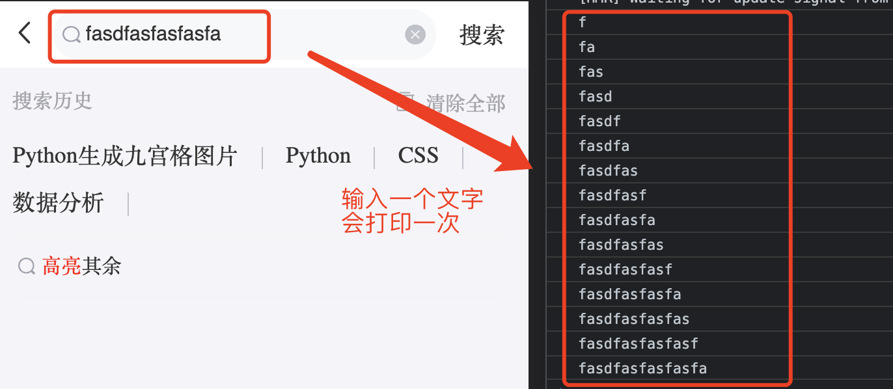
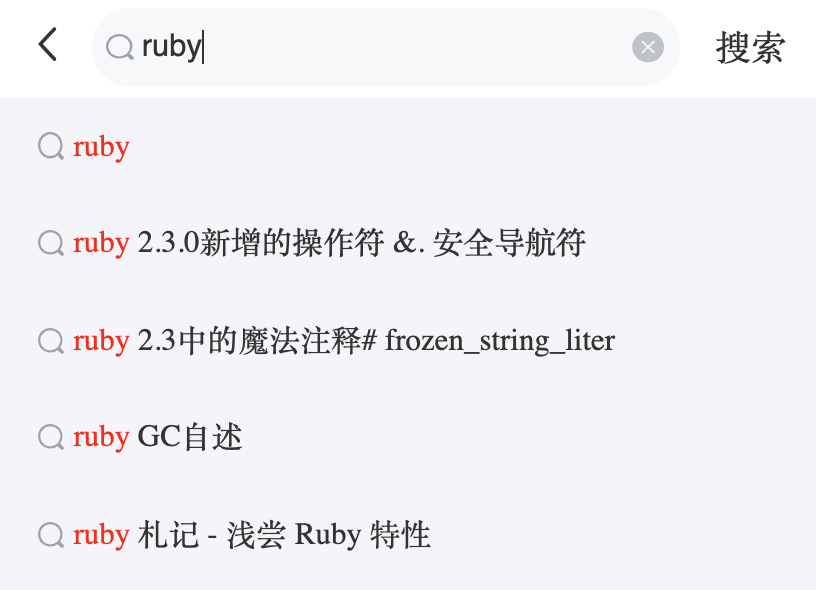
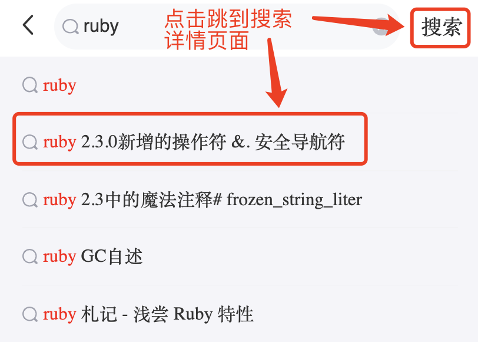
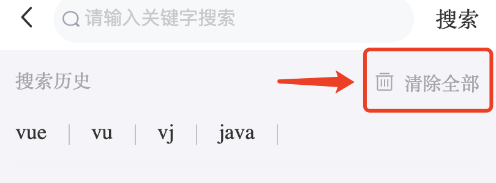
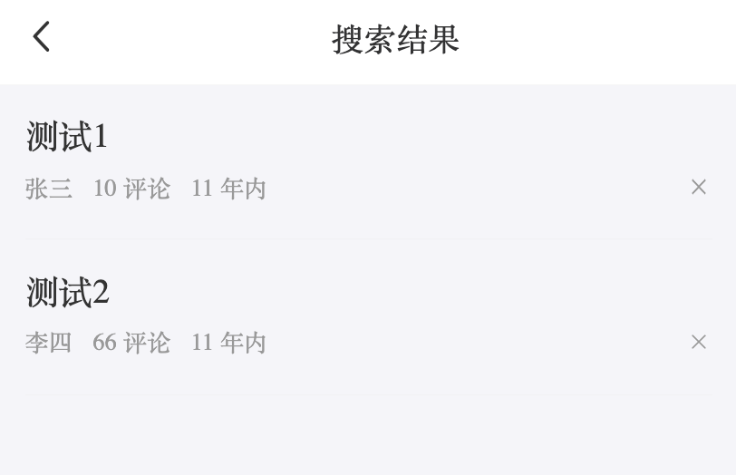

# 文章搜索

## 文章搜索页的静态结构

> 目标：实现文章搜索页面的主要静态结构和样式

**操作步骤**

1. 为首页 Tab 栏右边的 ”放大镜“ 按钮添加点击事件，点击后跳转到搜索页：

```jsx
import { useHistory } from 'react-router'
```

```jsx
const history = useHistory()
```

```jsx
<Icon type="iconbtn_search" onClick={() => history.push('/search')} />
```

2. 配置search的路由

## 搜索关键字的输入与防抖处理

> 目标：从文本输入框获取输入的关键字内容，且运用防抖机制降低获取频繁

实现思路：

- 防抖实现步骤：
  - 1）清理之前的定时器 
  - 2）新建定时器执行任务


**操作步骤**

1. 声明一个用于存放关键字的状态

```jsx
import { useState } from 'react'
```

```jsx
// 搜索关键字内容
const [keyword, setKeyword] = useState('')
```


2. 为搜索框设置 `value` 属性和 `onChange` 事件

```jsx
<Search
  placeholder="请输入关键字搜索"
  value={keyword}
  onChange={(e) => setKeyword(e)}
/>
```

当前效果：每次键盘敲击都会打印出输入框中的内容




3. 防抖处理

```jsx
import { useRef } from 'react'
```

```jsx
// 存储防抖定时器
const timerRef = useRef(-1)

const [keyword, setKeyword] = useState('')
const onChange = (e: string) => {
  setKeyword(e)
  // 清除之前的定时器
  clearTimeout(timerRef.current)
  // 新建任务定时器
  timerRef.current = window.setTimeout(() => {
    console.log(e)
  }, 500)
}
// 销毁组件时记得最好要清理定时器
useEffect(() => {
  return () => {
    clearTimeout(timerRef.current)
  }
}, [])
```

## aHooks的使用

**步骤**：

1. 安装 ahooks 包：`yarn add ahooks`
2. 导入 `useDebounceFn` hook
3. 创建防抖函数
4. 搜索框中输入内容时，调用防抖函数

**核心代码**

```tsx
const { run: getSuggest } = useDebounceFn(
    (e: string) => {
      console.log('搜索功能', e)
    },
    {
      wait: 500,
    }
  )

  const [keyword, setKeyword] = useState('')
  const onChange = (e: string) => {
    setKeyword(e)
    getSuggest(e)
  }

```

## 发送请求获取搜索建议数据

> 目标：将输入的关键发送到服务端，获取和该关键字匹配的建议数据

实现思路：

- 通过 Redux Action 来发送请求，获取结果数据后保存在 Redux Store 中

**核心代码**：

types/data.d.ts 中：

```ts
// 搜索关键词
export type Suggestion = string[]
```

types/store.d.ts 中：

```ts
// 联合到 RootAction 中
export type RootAction = LoginAction | ProfileAction | HomeAction | SearchAction

export type SearchAction = {
  type: 'search/suggestion'
  payload: Suggestion
}
```

actions/search.ts 中：

```ts
import { ApiResponse, Suggestion } from '@/types/data'
import { RootThunkAction } from '@/types/store'
import request from '@/utils/request'

export const getSuggestion = (value: string): RootThunkAction => {
  return async (dispatch) => {
    const res = await request.get<ApiResponse<{ options: Suggestion }>>(
      '/suggestion',
      {
        params: {
          q: value,
        },
      }
    )

    dispatch({ type: 'search/suggestion', payload: res.data.data.options })
  }
}
```

reducers/search.ts 中：

```ts
import { Suggestion } from '@/types/data'
import { SearchAction } from '@/types/store'

type SearchState = {
  suggestion: Suggestion
}

const initialState: SearchState = {
  suggestion: [],
}

const Search = (state = initialState, action: SearchAction): SearchState => {
  switch (action.type) {
    case 'search/suggestion':
      return {
        ...state,
        suggestion: action.payload,
      }

    default:
      return state
  }
}

export default Search

```

reducers/index.ts 中：

```ts
import search from './search'

const rootReducer = combineReducers({
  // ...
  search
})
```

Search/index.tsx组件中

```jsx
const { run } = useDebounceFn(
  (e: string) => {
    dispatch(getSuggestion(e))
  },
  {
    wait: 500,
  }
)

```

## 渲染推荐数据

+ 获取数据

```tsx
const { suggestion } = useSelector((state: RootState) => state.search)
```

+ 渲染推荐数据

```tsx
<div className={classnames('search-result', true ? 'show' : '')}>
  {suggestion.map((item, index) => {
    return (
      <div className="result-item" key={index}>
        <Icon className="icon-search" type="iconbtn_search" />
        <div className="result-value text-overflow">{item}</div>
      </div>
    )
  })}
</div>
```


## 高亮处理

+ 封装高亮函数

```jsx
const highLight = (str: string) => {
  return str.replace(
    new RegExp(keyword, 'gi'),
    (match) => `<span>${match}</span>`
  )
}
```

+ 封装高亮

> https://zh-hans.reactjs.org/docs/dom-elements.html

```jsx
<div
  className="result-value text-overflow"
  dangerouslySetInnerHTML={{
    __html: highLight(item)
  }}
></div>
```


## 搜索建议列表和搜索历史的按需显示

> 目标：实现在做搜索操作时只显示搜索建议列表；其他情况只显示搜索历史





实现思路：

- 利用之前创建的 `isSearching` 状态，控制建议列表和搜索历史的显示、隐藏


**操作步骤**

+ 提供isSearching状态

```jsx
// 是否显示搜索
const [isSearching, setIsSearching] = useState(false)
```

+ 修改isSearching状态

```jsx
const onChange = (e: string) => {
  setKeyword(e)
  if (e) {
    run(e)
    setIsSearching(true)
  } else {
    setIsSearching(false)
  }
}
```

+ 根据isSearching状态控制显示和隐藏

```jsx
{/* 搜索历史 */}
<div
  className="history"
  style={{ display: isSearching ? 'none' : 'block' }}
>

{/* 搜素建议结果列表 */}
<div
  className={classnames('search-result', {
    show: isSearching,
  })}
>
```


## 动态渲染搜索历史记录

> 目标：将每次输入的搜索关键字记录下来，再动态渲染到界面上


实现思路：

- 在成功搜索后，将关键字存入 Redux 和 LocalStorage 中
- 从 Redux 中获取所有关键字，并渲染到界面


**操作步骤**

+ 封装本地存储

```js

// 搜索关键字的本地缓存键名
const SEARCH_HIS_KEY = 'geek-h5-sh88-channel'

/**
 * 从缓存获取搜索历史关键字
 */
export const getLocalHistories = (): History => {
  return JSON.parse(localStorage.getItem(SEARCH_HIS_KEY) || '[]')
}

/**
 * 将搜索历史关键字存入本地缓存
 * @param {Array} histories
 */
export const setLocalHistories = (histories: History): void => {
  localStorage.setItem(SEARCH_HIS_KEY, JSON.stringify(histories))
}

/**
 * 删除本地缓存中的搜索历史关键字
 */
export const removeLocalHistories = () => {
  localStorage.removeItem(SEARCH_HIS_KEY)
}

```

+ data.d.ts中

```tsx
export type History = string[]

```


+ store.d.ts中

```tsx
export type SearchAction =
  | {
      type: 'search/suggestion'
      payload: Suggestion
    }
  | {
      type: 'search/history'
      payload: History
    }

```

+ action/history.ts中

```

```


---

## 点击搜索添加历史记录

> 目标：点击顶部 ”搜索“ 按钮，或点击搜索建议列表中的一项，跳转到搜索详情页





**操作步骤**

+ 注册事件进行搜索

```jsx
<NavBar
  className="navbar"
  onLeftClick={() => history.go(-1)}
  extra={
    <span className="search-text" onClick={() => onSearch(keyword)}>
      搜索
    </span>
  }
>

<div className="history-list">
  {histories.map((item, index) => {
    return (
      <span
        className="history-item"
        key={index}
        onClick={() => onSearch(item)}
      >
        {index !== 0 && <span className="divider"></span>}
        {item}
      </span>
    )
  })}
</div>

<div
  className="result-item"
  key={index}
  onClick={() => onSearch(item)}
>
  <Icon className="icon-search" type="iconbtn_search" />
  <div
    className="result-value"
    dangerouslySetInnerHTML={{
      __html: highlight(item, keyword),
    }}
  ></div>
</div>
```

+ 提供 *onSearch*方法

```jsx
const onSearch = (key: string) => {
  // console.log(key)
  // 保存搜索记录
  if (!key) return
  dispatch(addSearchList(key))
}
```

+ 在reducers中处理history

```jsx
const initValue: SeartchType = {
  // 存放推荐的结果
  suggestions: [],
  // 存放历史记录
  histories: [],
}

export type SearchAction =
  | {
      type: 'search/saveSuggestions'
      payload: string[]
    }
  | {
      type: 'search/clearSuggestions'
    }
  | {
      type: 'search/saveHistories'
      payload: string[]
    }

if (action.type === 'search/saveHistories') {
  return {
    ...state,
    histories: action.payload,
  }
}
```

+ actions中处理添加历史记录的action

```jsx
export function addSearchList(keyword: string): RootThunkAction {
  return async (dispatch, getState) => {
    // 获取到原来的histories
    let histories = getState().search.histories
    // 1. 不允许有重复的历史记录, 先删除原来历史记录中的keyword
    histories = histories.filter((item) => item !== keyword)
    // 添加keyword
    histories = [keyword, ...histories]
    // 最多显示10条
    if (histories.length > 10) {
      histories = histories.slice(0, 10)
    }
    // 保存 redux
    dispatch({
      type: 'search/saveHistories',
      payload: histories,
    })
    // 保存到本地
    setLocalHistories(histories)
  }
}
```

+ 页面渲染

```jsx
<div className="history-list">
    {histories.map((item, index) => {
      return (
        <span
          className="history-item"
          key={index}
          onClick={() => onSearch(item)}
        >
          {index !== 0 && <span className="divider"></span>}
          {item}
        </span>
      )
    })}
  </div>
```


---


## 清空搜索历史记录

> 目标：点击”清除全部“按钮后，删除全部的搜索历史记录





实现思路：

- 删除 Redux 和 LocalStorage 中存储的历史记录


**操作步骤**

+ 给清空按钮注册点击事件

```jsx
<div className="history-header">
  <span>搜索历史</span>
  <span onClick={onClearHistory}>
    <Icon type="iconbtn_del" />
    清除全部
  </span>
</div>
```

+ 显示弹窗

```jsx
const onClearHistory = () => {
  // 清空历史记录
  Dialog.confirm({
    title: '温馨提示',
    content: '你确定要清空记录吗？',
    onConfirm: function () {
      dispatch(clearHistories())
    },
  })
}
```

+ 在actions中准备action

```jsx
/**
 * 清空历史记录
 * @returns
 */
export function clearHistories(): RootThunkAction {
  return async (dispatch) => {
    // 清空本地历史记录
    removeLocalHistories()
    // 清空redux数据
    dispatch({
      type: 'search/clearHistories',
    })
  }
}

```

+ 在reducers中处理action

```jsx
export type SearchAction =
  | {
      type: 'search/clearHistories'
    }
    
export default function reducer(state = initValue, action: SearchAction) {

  if (action.type === 'search/clearHistories') {
    return {
      ...state,
      histories: [],
    }
  }
  return state
}

```


---


## 搜索详情页的静态结构

> 目标：实现搜索详情页的静态结构和样式





**操作步骤**

1. 将资源包中对应的样式文件，拷贝到 `pages/Search/Result/`目录下，然后编写该目录下的`index.js`：

```jsx
import NavBar from '@/components/NavBar'
import styles from './index.module.scss'

const SearchResult = () => {
  return (
    <div className={styles.root}>
      {/* 顶部导航栏 */}
      <NavBar>搜索结果</NavBar>

      <div className="article-list">
        <div>文章列表</div>
      </div>
    </div>
  )
}

export default SearchResult
```

2. 配置路由

```jsx
<Route path="/search" exact component={Search}></Route>
<Route path="/search/result" exact component={SearchResult}></Route>
```

3. 搜索的时候需要跳转

```jsx
const onSearch = (key: string) => {
  // console.log(key)
  // 保存搜索记录
  if (!key) return
  dispatch(addSearchList(key))

  // 跳转页面
  history.push('/search/result?key=' + key)
}
```


## 请求搜索详情页数据

> 目标：获取从搜索页面传入的参数后，调用后端接口获取搜索详情


**操作步骤**

1. 获取通过 URL 地址传入到搜索详情页的查询字符串参数 `q`

```js
// 获取通过 URL 地址传入的查询字符串参数const params = new URLSearchParams(location.search)const key = params.get('key')
```


2. 在 `store/reducers/search.js` 中添加保存搜索详情数据的 Reducer 逻辑

```js
const initValue: SeartchType = {
  // 存放推荐的结果
  suggestions: [],
  // 存放历史记录
  histories: [],
  // 存放搜索的结果
  results: [],
}

export default function reducer(state = initValue, action: SearchAction) {
  if (action.type === 'search/saveResults') {
    return {
      ...state,
      results: action.payload,
    }
  }
  return state
}
```


3. 在 `store/actions/search.js`中编写 Action Creator：

```jsx
/**
 * 获取搜索结果数据
 */
export function getSearchResults(
  keyword: string,
  page: number
): RootThunkAction {
  return async (dispatch) => {
    const res = await request.get<ResultRes>('search', {
      params: {
        q: keyword,
        page,
        per_page: 10,
      },
    })
    dispatch({
      type: 'search/saveResults',
      payload: res.data.results,
    })
  }
}
```


4. 在搜索详情页面中，通过 `useEffect` 在进入页面时调用以上编写的 Action：

```jsx
const location = useLocation()
const search = new URLSearchParams(location.search)
const key = search.get('key')!
const dispatch = useDispatch()
useEffect(() => {
  dispatch(getSearchResults(key, 1))
}, [dispatch, key])
```


## 渲染搜索详情列表

> 目标：将请求到的搜索详情数据渲染到界面上


**操作步骤**

1. 从 Redux 中获取搜索详情数据

```js
import { useDispatch, useSelector } from 'react-redux'
```

```js
const articles = useSelector(state => state.search.searchResults)
```


2. 将数据渲染成列表

```jsx
<div className="article-list">
  {results.map((item) => (
    <ArticleItem
      key={item.art_id}
      article={item}
      channelId={-1}
    ></ArticleItem>
  ))}
</div>
```


## 加载更多数据

+ 引入组件

```
import { InfiniteScroll } from 'antd-mobile-v5'
```

+ 渲染组件

```js
{/* 无限加载 */}<InfiniteScroll loadMore={loadMore} hasMore={hasMore} />
```

+ 提供属性

```jsx
// 是否有更多数据
const [hasMore, setHasMore] = useState(true)
// 加载状态
const [loading, setLoading] = useState(false)
```

+ 加载更多的逻辑

```jsx
let page = 1

const loadMore = async () => {
  if (loading) return
  setLoading(true)
  await dispatch(getSearchResults(key, page))
  page = page + 1
  setLoading(false)
  if (page > 5) {
    setHasMore(false)
  }
}
```


---

## 点击搜索详情列表跳到文章详情页

> 目标：实现在搜索详情列表中点击一个列表项，跳转到文章的详情页面


**操作步骤**

1. 为搜索详情列表项添加点击事件

```jsx
<div key={article.art_id} onClick={() => gotoAritcleDetail(article.art_id)}>
  // ...
</div>
```

```jsx
// 跳转到文章详情页面
const gotoAritcleDetail = articleId => {
  history.push(`/article/${articleId}`)
}
```


---

